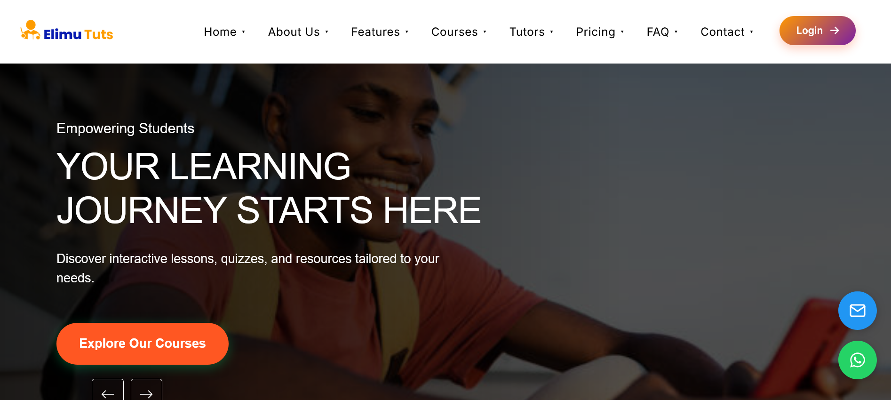

# 🎓 Democratizing Education Across Kenya

<div align="start">

<a href="./frontend/README.md">
  
</a>

## <a href="https://elimututs.com"></a>

<a href="https://elimututs.com">
  
  <p align="center"><em>Experience Elimu Tuts in action - Click to visit!</em></p>
</a>

</div>

## 📋 Table of Contents

- [Features](#-features)
- [Dashboard Features](#-dashboard-features)
- [Technology Stack](#-technology-stack)
- [Project Structure](#-project-structure)
- [API Endpoints](#-api-endpoints)
- [Database Models](#-database-models)
- [User Roles & Access Control](#-user-roles--access-control)
- [Authentication System](#-authentication-system)
- [Real-time Features](#-real-time-features)
- [Payment Integration](#-payment-integration)
- [Getting Started](#-getting-started)
- [Environment Variables](#-environment-variables)
- [Development Workflow](#-development-workflow)
- [Testing](#-testing)
- [Deployment](#-deployment)
- [Security Considerations](#-security-considerations)
- [Performance Optimizations](#-performance-optimizations)
- [Mobile Support](#-mobile-support)
- [Localization](#-localization)
- [Future Enhancements](#-future-enhancements)
- [Contributors](#-contributors)
- [License](#-license)
- [Contact](#-contact)

## 📖 Overview

Elimu-Tuts is a comprehensive online learning platform tailored for the Kenyan education system, specifically supporting the Competency-Based Curriculum (CBC). It provides an interactive space where students, tutors, and parents can connect and engage in a dynamic learning experience.

### 🎯 Key Objectives
- Bridge the educational gap across Kenya through technology
- Provide quality, accessible education aligned with CBC
- Create opportunities for both learners and educators
- Foster a collaborative learning community

### 💫 What Sets Us Apart
- **CBC Alignment**: Curriculum perfectly tailored to Kenya's education system
- **Interactive Learning**: Engaging multimedia content and real-time collaboration
- **Local Payment Integration**: Seamless M-Pesa integration for easy transactions
- **Community Focus**: Built by Kenyans, for Kenyans
- **Accessibility**: Works across various devices and internet conditions

### 🌟 Impact
- Making quality education accessible to all Kenyan students
- Supporting teachers in content delivery and student engagement
- Enabling parents to actively participate in their children's education
- Building a sustainable educational ecosystem

## 🚀 Features

### 🧑‍🎓 For Students
- **Course Enrollment**: Browse and enroll in courses created by verified tutors
- **Interactive Learning**: Access multimedia course content, including videos, documents, and interactive quizzes
- **Progress Tracking**: Monitor learning progress and assessment scores
- **Notes System**: Create, save, and organize personal study notes
- **Collaborative Notes**: Work with peers on shared study materials in real-time
- **Quizzes and Assessments**: Take quizzes and receive immediate feedback
- **Certificate Generation**: Earn certificates upon course completion
- **Communication**: Chat with tutors and fellow students
- **Resource Library**: Access educational resources aligned with CBC curriculum
- **Learning Path Customization**: Personalized learning journeys based on interests and goals

### 👨‍🏫 For Tutors
- **Course Creation**: Build and publish courses with comprehensive curriculum tools
- **Content Management**: Upload various content types (video, audio, documents)
- **Assessment Creation**: Design quizzes, tests, and assignments
- **Student Management**: Track student enrollment and progress
- **Performance Analytics**: Analyze student performance and course effectiveness
- **Revenue Tracking**: Monitor course earnings and student enrollment statistics
- **Live Sessions**: Host real-time classes and interactive sessions
- **Communication**: Direct messaging with students and parents
- **Scheduling Tools**: Manage class schedules and availability
- **Content Versioning**: Track changes and updates to course materials

### 👪 For Parents
- **Child Progress Monitoring**: Track academic performance and course completion
- **Tutor Communication**: Direct messaging with tutors
- **Payment Management**: Manage course payments and subscriptions
- **Performance Reports**: Receive detailed progress reports
- **Resource Access**: Access parent-focused educational resources
- **Schedule Viewing**: Monitor learning schedule and upcoming assignments
- **Multiple Children Management**: Track progress for multiple children from a single account
- **Payment History**: Review all past transactions and receipts

## 📊 Dashboard Features

### 📚 Student Dashboard
- **Personalized Home**: Overview of enrolled courses, upcoming assignments, and progress statistics
- **Course Library**: Browse and filter available courses by subject, level, rating, and price
- **My Courses**: Access enrolled courses with progress tracking and resumption points
- **Assignments & Quizzes**: View, complete, and track assignments and quiz performance
- **Study Notes**: Create, organize, and search through personal notes
- **Collaborative Space**: Join and participate in shared documents and study groups
- **Calendar**: Visualize schedule with upcoming classes, assignments, and deadlines
- **Notifications Center**: Receive alerts for new content, messages, and important updates
- **Achievement Badges**: Earn and display learning achievements and milestones
- **Resource Library**: Access supplementary learning materials and CBC resources

### 👨‍🏫 Tutor Dashboard
- **Performance Overview**: Real-time analytics on course engagement, revenue, and student progress
- **Course Management**: Create, edit, and publish courses with curriculum builder
- **Student Insights**: Track individual student performance and identify areas for improvement
- **Content Studio**: Upload and organize learning materials (videos, PDFs, presentations)
- **Quiz Creator**: Build interactive assessments with various question types
- **Discussion Management**: Moderate and participate in course discussions
- **Live Session Tools**: Schedule and host real-time virtual classes
- **Earnings Reports**: Track revenue streams and payment history
- **Calendar Management**: Organize teaching schedule and availability
- **Communication Center**: Message students and parents directly

### 👨‍👩‍👧‍👦 Parent Dashboard
- **Children Overview**: Monitor progress for all registered children
- **Academic Performance**: Review detailed performance reports and assessment results
- **Tutor Communication**: Direct messaging with course tutors
- **Payment Management**: Make payments, manage subscriptions, and view payment history
- **Calendar View**: Track children's class schedules and assignment deadlines
- **Resource Center**: Access parent guides and educational resources
- **Notification Settings**: Configure alerts for important updates and performance thresholds
- **Parent Community**: Connect with other parents in moderated discussion forums

## 💰 M-Pesa Daraja API Integration

The platform features a robust integration with Safaricom's M-Pesa Daraja API for seamless mobile payments specifically designed for the Kenyan market:

- **STK Push**: Direct payment prompts to user phones for frictionless transactions
- **Transaction Verification**: Real-time verification of payment completion
- **Payment Callbacks**: Automated system responses to successful/failed transactions
- **Transaction Logging**: Comprehensive records of all payment activities
- **Security Features**: Encryption of sensitive payment data and transaction information
- **Sandbox Testing**: Development environment for testing payment flows

## 🔄 Socket.io Real-time Features

The platform leverages Socket.io to provide a rich, interactive real-time experience:

- **Collaborative Document Editing**: Simultaneous editing of shared notes with cursor tracking
- **Live Chat System**: Instant messaging between students, tutors, and parents
- **Real-time Notifications**: Instant alerts for messages, course updates, and system announcement
- **Presence Indicators**: Show when users are online, away, or offline
- **Typing Indicators**: Visual cues when chat participants are typing messages
- **Error Handling**: Graceful degradation when real-time connection fails

## 🔧 Technology Stack

### Frontend
- **React 18+**: Building the user interface with functional components and hooks
- **React Router 6**: Handling navigation with the latest routing features
- **Context API + useReducer**: State management with custom hooks
- **Axios**: API requests with interceptors for authentication and error handling
- **Socket.io-client**: Real-time communication with reconnection handling
- **React-Toastify**: User notification system for feedback and alerts
- **Firebase SDK**: Authentication with email/password and social logins
- **React-Query**: Data fetching, caching, and state management
- **CSS Modules + SASS**: Component-scoped styling with preprocessor benefits
- **Chart.js/Recharts**: Data visualization for analytics and reporting
- **React DnD**: Drag-and-drop interfaces for curriculum building
- **Vite**: Fast build tool and development server

### Backend
- **Node.js & Express**: Server and API framework with middleware support
- **MongoDB**: NoSQL database for flexible data storage and querying
- **Mongoose**: ODM for MongoDB with validation, middleware, and schema management
- **Firebase Admin**: Authentication, user management, and security
- **Socket.io**: WebSocket implementation for real-time features with rooms and namespaces
- **Multer + Cloudinary**: File uploads and cloud storage management
- **JWT**: Token-based authentication with refresh token mechanism
- **Express Validator**: Request validation middleware
- **Helmet**: Security headers for Express apps
- **Morgan**: HTTP request logging
- **Nodemailer**: Email notifications and alerts
- **Agenda/Bull**: Job scheduling for periodic tasks
- **Redis**:  For session management and caching
- **M-Pesa Daraja API**: Mobile payment processing integration

## 📁 Project Structure

### Frontend Structure
```
frontend/
├── public/              # Static files
├── src/
│   ├── assets/          # Images, fonts, and other static assets
│   │   ├── auth/        # Authentication related components
│   │   ├── common/      # Shared components (buttons, inputs, etc.)
│   │   ├── dashboard/   # Dashboard components
│   │   │   ├── students/  # Student-specific dashboard components
│   │   │   ├── tutors/    # Tutor-specific dashboard components
│   │   │   └── parent/    # Parent-specific dashboard components
│   │   └── layout/      # Layout components (header, footer, etc.)
│   ├── config/          # Configuration files
│   ├── context/         # React Context providers
│   ├── firebase/        # Firebase configuration and utilities
│   ├── hooks/           # Custom React hooks
│   ├── pages/           # Page components
│   │   ├── auth/        # Authentication pages
│   │   ├── dashboard/   # Dashboard pages
│   │   └── landing/     # Public landing pages
│   ├── services/        # API service functions
│   ├── socket/          # WebSocket connection and event handlers
│   ├── utils/           # Utility functions
│   ├── App.jsx          # Main application component
│   ├── App.css          # Global styles
│   ├── main.jsx         # Application entry point
│   └── index.css        # Global CSS
├── .env                 # Environment variables
├── package.json         # Dependencies and scripts
└── vite.config.js       # Vite configuration
```

### Backend Structure
```
backend/
├── config/              # Configuration files
├── controllers/         # Request handlers
│   ├── courseController.js    # Course management logic
│   ├── orderController.js     # Payment and order logic
│   ├── quizController.js      # Quiz functionality
│   └── userController.js      # User management
├── middleware/          # Express middleware
│   ├── auth.js          # Authentication middleware
│   └── firebaseAuth.js  # Firebase authentication
├── models/              # Mongoose data models
│   ├── Course.js        # Course schema
│   ├── Note.js          # Study notes schema
│   ├── Order.js         # Payment orders schema
│   ├── Quiz.js          # Quiz schema
│   └── User.js          # User schema
├── routes/              # API route definitions
│   ├── courses.js       # Course-related routes
│   ├── notes.js         # Note-related routes
│   ├── orders.js        # Payment & order routes
│   ├── quizzes.js       # Quiz-related routes
│   ├── tutor.js         # Tutor-specific routes
│   └── users.js         # User management routes
├── services/            # External service integrations
│   └── mpesa.js         # M-Pesa integration service
├── socket/              # WebSocket event handlers
│   ├── chat.js          # Chat functionality
│   ├── collaboration.js # Collaborative editing
│   └── notifications.js # Real-time notifications
├── utils/               # Utility functions
├── .env                 # Environment variables
├── package.json         # Dependencies and scripts
└── server.js            # Main server entry point
```

## 📡 API Endpoints

### Authentication
- `POST /api/users/register` - Register a new user
- `POST /api/users/login` - User login
- `GET /api/users/me` - Get current user profile
- `PUT /api/users/update` - Update user profile
- `POST /api/users/forgot-password` - Request password reset
- `POST /api/users/reset-password` - Reset password with token

### Courses
- `GET /api/courses` - Get all courses (with filtering options)
- `GET /api/courses/:id` - Get specific course details
- `POST /api/courses` - Create a new course (authenticated tutors only)
- `PUT /api/courses/:id` - Update course details (course owner only)
- `DELETE /api/courses/:id` - Delete a course (course owner only)
- `GET /api/courses/:id/lessons` - Get course lessons
- `POST /api/courses/:id/enroll` - Enroll in a course

### Tutor APIs
- `GET /api/tutor/courses` - Get courses by tutor ID
- `POST /api/tutor/courses` - Create a new course as a tutor
- `PUT /api/tutor/courses/:id` - Update a tutor's course
- `DELETE /api/tutor/courses/:id` - Delete a tutor's course
- `GET /api/tutor/students` - Get tutor's enrolled students
- `GET /api/tutor/analytics` - Get teaching analytics and statistics

### Notes
- `GET /api/notes` - Get user's notes
- `GET /api/notes/:id` - Get specific note details
- `POST /api/notes` - Create a new note
- `PUT /api/notes/:id` - Update a note
- `DELETE /api/notes/:id` - Delete a note
- `POST /api/notes/:id/share` - Share a note with other users
- `GET /api/notes/collaborative` - Get shared collaborative notes

### Quizzes
- `GET /api/quizzes` - Get all quizzes
- `GET /api/quizzes/:id` - Get specific quiz details
- `POST /api/quizzes` - Create a new quiz (authenticated tutors only)
- `PUT /api/quizzes/:id` - Update quiz details (quiz owner only)
- `DELETE /api/quizzes/:id` - Delete a quiz (quiz owner only)
- `POST /api/quizzes/:id/submit` - Submit quiz answers
- `GET /api/quizzes/:id/results` - Get quiz results

### Orders/Payments
- `POST /api/orders` - Create a new order
- `GET /api/orders` - Get user's orders
- `GET /api/orders/:id` - Get specific order details
- `PUT /api/orders/:id` - Update order status (admin only)
- `POST /api/payments/mpesa/stkpush` - Initiate M-Pesa STK push payment
- `POST /api/payments/mpesa/callback` - M-Pesa transaction callback endpoint
- `GET /api/payments/history` - Get payment transaction history

### Socket.io Event Endpoints
- `connection` - Client connects to WebSocket server
- `disconnect` - Client disconnects from server
- `join_room` - Join a specific chat or collaboration room
- `leave_room` - Leave a specific room
- `send_message` - Send a chat message to a room
- `receive_message` - Receive a chat message in a room
- `typing` - Indicate user is typing
- `stopped_typing` - Indicate user stopped typing
- `document_change` - Collaborative document change
- `cursor_position` - Share cursor position in collaborative editing
- `notification` - Real-time notification event
- `presence_update` - Update user online status

## 💾 Database Models

### User Model
- Authentication details (Firebase UID)
- Profile information (name, email, phone, etc.)
- Role (student, tutor, parent, admin)
- Profile image URL
- Registration date
- Last login timestamp
- Preferences and settings
- Connected accounts (for parents tracking children)

### Course Model
- Basic information (title, description, subject, level)
- Curriculum content (lessons, materials, resources)
- Learning objectives and outcomes
- Pricing details and discount options
- Tutor information and credentials
- Cover image and promotional media
- Duration and estimated completion time
- Difficulty level (Beginner, Intermediate, Advanced)
- CBC alignment indicators
- Enrollment data (students, progress tracking)
- Ratings and reviews
- Creation and update timestamps

### Quiz Model
- Title and description
- Questions and answers with multiple formats (MCQ, true/false, matching)
- Scoring mechanism and passing threshold
- Time limits and attempt restrictions
- Difficulty levels and CBC alignment
- Associated course or standalone status
- Randomization settings
- Feedback configuration
- Creation and update timestamps

### Note Model
- Title and content (rich text)
- Owner information and creation details
- Tags, categories, and related course reference
- Sharing permissions and collaborators list
- Version history and edit tracking
- Last edited timestamp and editor information
- Associated files or attachments

### Order Model
- Order ID and reference number
- User information and contact details
- Course/product details and quantity
- Total amount and currency
- Payment information and method
- Transaction ID and reference
- Transaction status and completion details
- Payment date and processing timestamps
- Receipt information

## 🔐 User Roles & Access Control

### Role-Based Access Control
- **Students**: Can enroll in courses, take quizzes, create notes, and participate in discussions
- **Tutors**: Can create and manage courses, create quizzes, and interact with enrolled students
- **Parents**: Can monitor their children's progress, communicate with tutors, and manage payments
- **Administrators**: Full system access, including user management and content moderation

### Permission Management
- Firebase Authentication for identity verification
- Custom middleware for role-based route protection
- Document-level permissions for collaborative features
- Feature-based access controls with granular permissions
- Multi-factor authentication for sensitive operations

## 🔒 Authentication System

- **Firebase Authentication**: Email/password and social login options (Google, Facebook)
- **JWT Tokens**: Generated after successful login for API authorization
- **Refresh Token Mechanism**: Automatic token renewal without requiring re-login
- **Session Management**: Secure, HttpOnly cookies for web sessions
- **Multi-device Support**: Login from multiple devices with session tracking
- **Account Linking**: Connect multiple authentication methods to one account
- **Password Policies**: Enforce strong password requirements
- **Login Attempt Limiting**: Prevent brute force attacks
- **Email Verification**: Verify user email addresses before full access
- **Account Recovery**: Secure password reset workflow

## ⚡ Real-time Features

- **WebSocket Integration**: Using Socket.io for reliable real-time communication
- **Live Chat System**: Real-time messaging between students, tutors, and parents
- **Collaborative Editing**: Simultaneous note editing with conflict resolution
- **Notifications**: Instant alerts for important events and messages
- **Presence Indicators**: Show online status of users in real-time
- **Live Class Sessions**: Real-time video and audio communication
- **Interactive Whiteboards**: Shared drawing and annotation tools
- **Real-time Quizzes**: Live quiz participation with immediate results
- **Cursor Tracking**: See other users' cursors in collaborative documents
- **Typing Indicators**: Show when chat participants are typing
- **Auto-reconnection**: Handle connection interruptions gracefully
- **Room Management**: Create and join specific discussion or collaboration spaces
- **Broadcast Messaging**: Send announcements to all connected users
- **Event Stream**: Activity feed with real-time updates


## 🚀 Getting Started

### Prerequisites
- Node.js (v14 or higher)
- MongoDB (local or Atlas cloud database)
- Firebase account (for authentication)
- M-Pesa Daraja API credentials (for payments)
- Git (for version control)

### Installation

1. Clone the repository
```bash
git clone https://github.com/your-username/elimu-tuts.git
cd elimu-tuts
```

2. Install dependencies for both frontend and backend
```bash
# Install backend dependencies
cd backend
npm install

# Install frontend dependencies
cd ../frontend
npm install
```

3. Set up environment variables
   - Create `.env` files in both the frontend and backend directories
   - Configure necessary environment variables (see Environment Variables section)

4. Run the application
```bash
# Start the backend server
cd backend
npm start

# Start the frontend development server
cd ../frontend
npm run dev
```

## 🌐 Environment Variables

### Frontend (.env)
```
VITE_API_URL=http://localhost:5000
VITE_FIREBASE_API_KEY=your-firebase-api-key
VITE_FIREBASE_AUTH_DOMAIN=your-firebase-auth-domain
VITE_FIREBASE_PROJECT_ID=your-firebase-project-id
VITE_FIREBASE_STORAGE_BUCKET=your-firebase-storage-bucket
VITE_FIREBASE_MESSAGING_SENDER_ID=your-messaging-sender-id
VITE_FIREBASE_APP_ID=your-firebase-app-id
VITE_SOCKET_ENDPOINT=http://localhost:5000
```

### Backend (.env)
```
MONGO_URI=your-mongodb-connection-string
PORT=5000
NODE_ENV=development
JWT_SECRET=your-jwt-secret
JWT_EXPIRE=30d
FIREBASE_SERVICE_ACCOUNT_PATH=./config/serviceAccountKey.json
MPESA_CONSUMER_KEY=your-mpesa-consumer-key
MPESA_CONSUMER_SECRET=your-mpesa-consumer-secret
MPESA_SHORTCODE=your-mpesa-shortcode
MPESA_PASSKEY=your-mpesa-passkey
MPESA_CALLBACK_URL=your-callback-url
```

## 📱 Mobile Support
The web application is responsive and works on mobile devices. The application has been tested and optimized for:

- iOS (Safari, Chrome)
- Android (Chrome, Firefox, Samsung Internet)
- Various screen sizes (phone, tablet, desktop)

A dedicated mobile app is planned for future releases.

## 🌐 Localization
The platform primarily supports English and Kiswahili, with plans to add more languages relevant to the Kenyan education system.

- Text content is stored in language-specific JSON files
- Date, time, and number formatting follow local conventions
- Currency display adapts to user preferences
- Right-to-left language support is planned for future releases

## 🔮 Future Enhancements
- **AI-powered tutoring**: Smart tutoring based on student performance patterns
- **Mobile app**: Native mobile applications for Android and iOS
- **Expanded curriculum**: Additional subjects and content aligned with CBC updates
- **AR/VR integration**: Immersive learning experiences for complex topics
- **Advanced analytics**: Enhanced reporting and predictive insights
- **Offline mode**: Full functionality when internet connection is limited
- **Accessibility improvements**: Better support for users with disabilities
- **Blockchain certificates**: Blockchain-based certification verification
- **Gamification elements**: Achievement badges, points, and learning challenges
- **Peer tutoring marketplace**: Student-to-student help sessions
- **Parent community features**: Discussion forums and resource sharing
- **Integration with school systems**: Direct connection with institutional LMS

## 👥 Contributors
- Hassan Faruq - FullStack Developer
- Elizabeth Julius - Backend Developer
- Ronney Oduor - Frontend Developer
- Jasmine Hano - Frontend Developer, UI/UX Designer

## 📝 License
This project is licensed under the MIT License - see the LICENSE file for details.

## 📞 Contact
For any questions or support, please reach out via our communication channels or contact us directly
