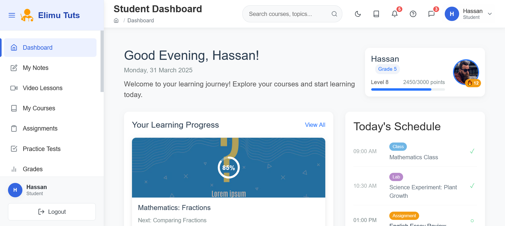

# 🚀 The Story Behind Elimu Tuts

[Technical Documentation](../README.md)

## 👋 Meet Group 21 MERN Stack Team

We are a passionate team of developers who came together through Power Learn Project (PLP) to create something meaningful for education in Kenya. Our journey began with a simple idea: to make quality education accessible to all.

## 💡 Our Journey

### Week 1: The Beginning
- Day 1-2: Team formation and project planning
- Day 3-5: Core development and feature implementation
- Day 6-7: Initial testing and feedback

### Week 2: The Final Push
- Day 1-3: Feature completion and integration
- Day 4-5: Testing and optimization
- Day 6-7: Deployment and final refinements

## 🎯 Our Vision

We believe in the power of technology to transform education. Elimu Tuts isn't just a platform; it's a movement towards making quality education accessible to every Kenyan student, regardless of their location or background.

## 🌟 Team Highlights

### What Makes Us Special
- Diverse team with unique perspectives
- Passion for education and technology
- Strong commitment to user experience
- Innovative problem-solving approach

### Our Values
- Innovation in education
- Accessibility for all
- Quality learning experience
- Community-driven development

## 🎨 UI Showcase

### Landing Page

*Our welcoming landing page designed to inspire learners*

### Student Dashboard

*Interactive dashboard for seamless learning experience*

## 🤝 Our Supporters

### Power Learn Project (PLP)
- Provided the platform and opportunity
- Mentored us throughout the journey
- Connected us with industry experts

### Safaricom hook
- For support and resources
- Industry mentorship, insights and guidance

## 💪 Challenges We Faced

### Technical Challenges
- Real-time feature implementation
- Mobile responsiveness
- Performance optimization

### How We Overcame
- Collaborative problem-solving
- Research and innovation
- Continuous learning and adaptation

## 🌟 What We Learned

- The importance of user-centered design
- Value of teamwork and communication
- Power of perseverance
- Impact of technology in education

## 🎯 Future Aspirations

We envision Elimu Tuts becoming:
- The leading educational platform in Kenya
- A catalyst for educational innovation
- A community of learners and educators
- A model for educational technology

## 🙏 Acknowledgments

Special thanks to:
- Power Learn Project (PLP) for providing us with the opportunity to learn full-stack development and guiding us through this journey
- Safaricom for partnering with PLP to make this scholarship possible
- Our mentors and instructors who guided us through the learning process
- The entire PLP community for their support and encouragement

---
*"Education is the most powerful weapon which you can use to change the world." - Nelson Mandela*

Made with ❤️ by Group 21 MERN Stack Team
